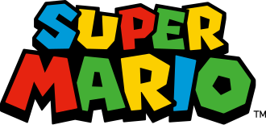
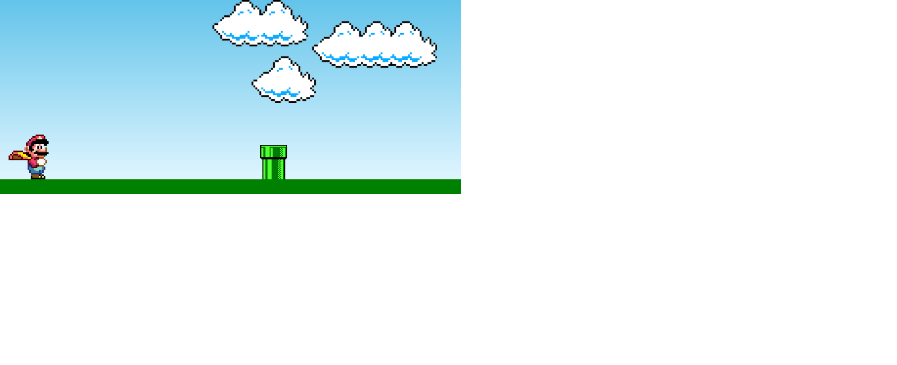
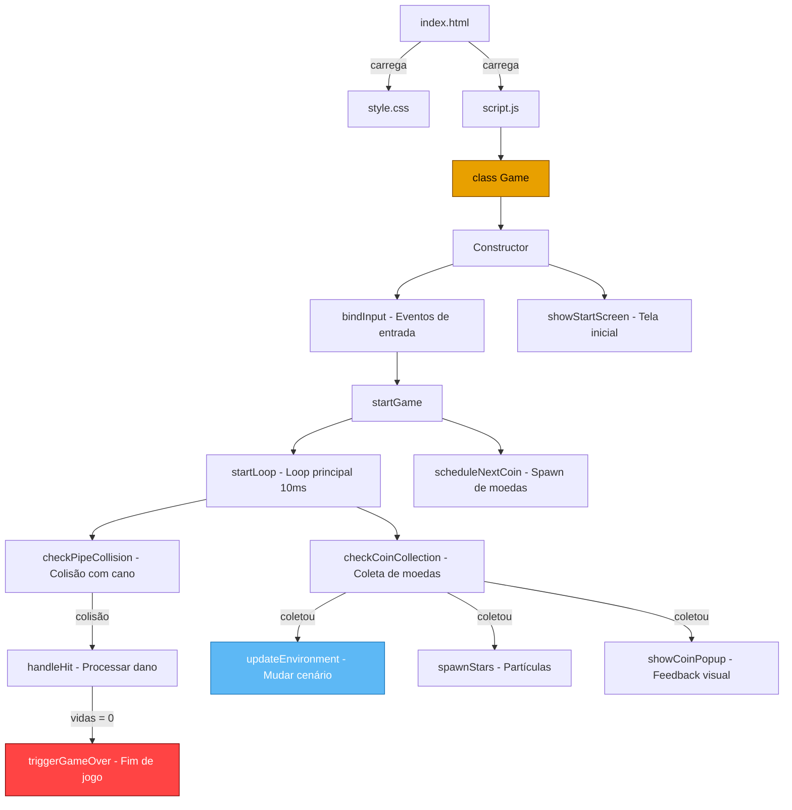

<p align="center">
  
</p>

<h1 align="center">🍄 Super Mario — Jogo Web</h1>

<p align="center">
  Um jogo inspirado no clássico <em>Chrome Dino Runner</em>, reimaginado com o universo do <strong>Super Mario Bros</strong>.<br>
  Desenvolvido com <strong>HTML5</strong>, <strong>CSS3</strong> e <strong>JavaScript puro (Vanilla JS)</strong> — sem frameworks ou bibliotecas externas.
</p>

<p align="center">
  
  
  
</p>

---

## 📸 Preview

<p align="center">
  
</p>

---

## 🎮 Sobre o Projeto

Este projeto é uma recriação do conceito do **jogo do dinossauro do Google Chrome**, porém ambientado no universo do **Super Mario Bros**. O jogador controla o Mario, que deve pular sobre canos e coletar moedas enquanto o cenário se move automaticamente.

O jogo foi construído inteiramente com tecnologias web nativas, sem o uso de engines de jogos, canvas ou bibliotecas externas, demonstrando o poder do **DOM manipulation**, **CSS animations** e **JavaScript orientado a objetos**.

---

## ✨ Funcionalidades

| Funcionalidade | Descrição |
|---|---|
| 🏃 **Gameplay Infinito** | O cano se move continuamente da direita para a esquerda em loop infinito |
| 🦘 **Pulo com Física** | Mario pula com animação suave via CSS keyframes (`ease-out`) |
| ❤️ **Sistema de Vidas** | 3 vidas com feedback visual (corações que ficam cinza ao perder) |
| 🪙 **Coleta de Moedas** | Moedas surgem em posições e velocidades aleatórias para coleta |
| 🌅 **Cenário Dinâmico** | O céu muda conforme as moedas coletadas: dia → tarde → noite |
| ⭐ **Efeitos de Partículas** | Estrelas animadas surgem ao coletar moedas |
| 🔊 **Efeitos Sonoros** | Sons para pulo, coleta de moeda, morte e música tema de fundo |
| 💀 **Tela de Game Over** | Overlay com estatísticas e botão para reiniciar |
| 🖥️ **Tela de Início** | Splash screen com logo clicável para começar |
| 📱 **Responsivo** | Layout adaptado para telas menores (mobile) |
| ♿ **Acessível** | Uso de `role`, `aria-label`, `aria-live` para leitores de tela |

---

## 🛠️ Tecnologias e Conceitos Utilizados

### Estrutura (HTML5)
- HTML semântico com `<header>`, `<main>`, `<h1>`, `<dl>`, `<dt>`, `<dd>`
- Atributos de acessibilidade (`role`, `aria-label`, `aria-modal`, `aria-live`, `aria-hidden`)
- Separação entre HUD (cabeçalho fixo), arena do jogo e overlays modais

### Estilização (CSS3)
- **CSS Custom Properties (variáveis)** para paleta de cores, durações e tamanhos
- **Gradientes lineares** para o céu e o chão com padrão listrado
- **CSS Keyframes Animations**: 9 animações distintas para movimentação do cano, pulo do Mario, nuvens, moedas, partículas, popups e transições
- **`clamp()`** para tipografia responsiva
- **`backdrop-filter: blur()`** nos overlays (Game Over e Start Screen)
- **`drop-shadow`** e **`filter`** para efeitos visuais nos sprites
- **Media Queries** para responsividade em telas ≤ 620px

### Lógica (JavaScript ES6+)
- **Classe ES6 (`class Game`)** com encapsulamento completo usando **campos privados (`#`)**
- **Padrão de configuração centralizada** via `static CONFIG` — todos os valores numéricos do jogo em um único lugar
- **Detecção de colisão AABB** (Axis-Aligned Bounding Box) para cano e moedas
- **Sistema de invencibilidade temporária** após levar dano
- **Spawn dinâmico de moedas** com intervalos e velocidades aleatórias via `setTimeout` recursivo
- **Event-driven input** suportando teclado (`Space`/`ArrowUp`), toque (`touchstart`) e clique
- **Manipulação do DOM** para criar/remover elementos dinamicamente (moedas, partículas de estrela)
- **Web Audio API** para reprodução de efeitos sonoros

---

## 📁 Estrutura do Projeto

```
Jogomario/
├── index.html          # Estrutura da página e elementos do jogo
├── style.css           # Estilos, animações e responsividade
├── script.js           # Classe Game com toda a lógica do jogo
├── README.md           # Documentação do projeto
│
├── img/
│   ├── mario.gif           # Sprite animado do Mario correndo
│   ├── pipe.png            # Sprite do cano (obstáculo)
│   ├── clouds.png          # Sprite das nuvens do cenário
│   ├── start-game.png      # Logo da tela inicial
│   ├── game-over.png       # Sprite do Mario derrotado
│   ├── Mario-ico.ico       # Favicon do jogo
│   ├── printGame.png       # Screenshot do jogo
│   └── print-jogo-do-mario.jpeg
│
└── sounds/
    ├── sundtheme.mp3       # Música tema de fundo
    ├── jump.mp3            # Som de pulo
    ├── coin.mp3            # Som de coleta de moeda
    └── death.mp3           # Som de game over
```

---

## 🚀 Como Executar

1. **Clone o repositório:**
   ```bash
   git clone https://github.com/seu-usuario/Jogomario.git
   ```

2. **Acesse a pasta do projeto:**
   ```bash
   cd Jogomario
   ```

3. **Abra o arquivo `index.html` no navegador:**
   ```bash
   # Ou simplesmente dê dois cliques no arquivo index.html
   start index.html
   ```

> [!NOTE]
> Não é necessário nenhum servidor, build tool ou instalação de dependências.
> O jogo roda diretamente no navegador com arquivos estáticos.

---

## 🎯 Como Jogar

| Ação | Controle |
|---|---|
| **Pular** | `Espaço`, `Seta para cima`, clique ou toque na tela |
| **Iniciar** | Clique na tela de início |
| **Reiniciar** | Clique no botão "JOGAR NOVAMENTE" após Game Over |

### Objetivo
- Pule sobre os **canos** para não perder vidas
- Colete **moedas** para aumentar sua pontuação
- Sobreviva o máximo possível com apenas **3 vidas**!

### Dicas
- 🌅 Ao coletar **10 moedas**, o cenário muda para o entardecer
- 🌙 Ao coletar **20 moedas**, o cenário muda para a noite
- 💥 Após ser atingido, o Mario fica **invencível por 1.2 segundos**

---

## 🏗️ Arquitetura do Código



---

## 🎨 Design e Estilo Visual

O visual do jogo segue a estética **pixel art / retro gaming**:

- **Fonte:** [Press Start 2P](https://fonts.google.com/specimen/Press+Start+2P) — tipografia estilo 8-bit
- **Paleta de cores:**

| Cor | Hex | Uso |
|---|---|---|
| 🔵 Céu (topo) | `#5db8f5` | Gradiente do céu diurno |
| 🟢 Chão | `#3d9e00` | Base inferior da arena |
| 🟡 Dourado | `#e8a000` | HUD, bordas, botões |
| 🔴 Perigo | `#ff4444` | Texto de Game Over |
| 🟠 Tarde | `#ff8c00` | Céu ao coletar 10+ moedas |
| 🔵 Noite | `#191970` | Céu ao coletar 20+ moedas |

---

## 📝 Licença

Este projeto é de uso livre para fins educacionais e de aprendizado.
Os assets (imagens e sons) do Mario são propriedade da **Nintendo** e são usados aqui apenas para fins de estudo.

---

<p align="center">
  Feito com ❤️ e muitas moedas 🪙
</p>
